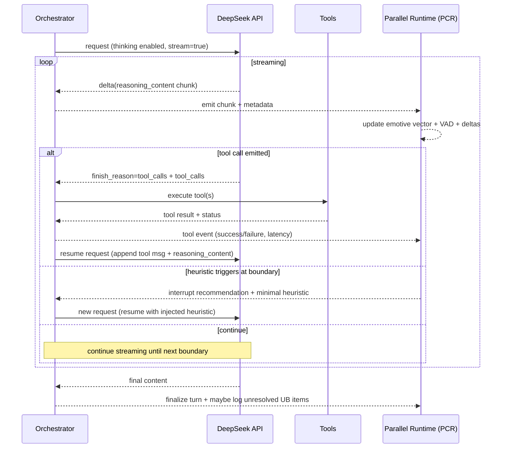

# Bolt-on Parallel Cognitive Runtime for LLM Agents

## Executive summary

This report designs a bolt-on “parallel cognitive runtime” (PCR) for an LLM-driven agent (your Vicuña system) that continuously estimates a multidimensional **emotive moment** state from **streaming reasoning traces** plus **tool events**, projects that state into **VAD (valence–arousal–dominance)** for human-readable introspection, and turns sharp negative state deltas into a structured **unfinished business → improved episode → heuristic library** pipeline. The runtime then **retrieves and injects** minimal, constrained heuristics during future reasoning when it detects high similarity to earlier bad trajectories, using **chunk-boundary interruption + resume**.

The approach is research-grounded in three relevant lines of work:

- **Process supervision / step-level feedback**: Rewarding or evaluating intermediate steps (not just final answers) can materially improve reasoning quality; the “negative delta” signal is positioned as a *proxy* step-level process penalty akin to process reward modeling, though computed from observable process and tool dynamics rather than human labels. citeturn0search12turn0search7turn0search3  
- **Reflexion-style self-improvement**: Language agents can improve without weight updates by storing reflective text/experience and using it to bias future trials; your design generalizes this by (a) triggering review via delta-based credit assignment and (b) compressing differences into reusable heuristics rather than storing only narration. citeturn1search0turn1search4  
- **Experience replay for language agents**: Recent work explicitly records/summarizes traces into “experience” and replays them in context to guide actions; your “bad → better → heuristic” loop is a step-level, policy-shaped variant of replay with online retrieval and targeted injection. citeturn1search6turn1search7turn1search2  

A practical implementation is feasible with the entity["company","DeepSeek","ai model provider"] API, but must respect these constraints:

- `deepseek-reasoner` exposes `reasoning_content` (CoT) but **does not support Function Calling** and rejects several sampling/logprob parameters (notably `logprobs` / `top_logprobs`) and requires removing `reasoning_content` from future turns. citeturn4view0  
- The “thinking mode” tool loop is supported on `deepseek-chat` (DeepSeek-V3.2+), but requires that you pass `reasoning_content` back during the same turn’s sub-requests; otherwise a **400 error** occurs. citeturn5view0turn5view1  
- Therefore, the PCR must own the **agent loop** and implement “interrupt + resume” using **micro-turn chunking** and boundary-time reinjection rather than true mid-token control.

The remainder of this report provides concrete JSON schemas, pseudocode, similarity and interruption policies, a tech stack, mermaid diagrams, example interruption/resume snippets, an evaluation plan, failure modes, and a one-page lab pitch.

## Research foundations

### Process supervision as step-level control signal

Process supervision explicitly labels intermediate reasoning steps and trains reward models that score steps, showing large gains over outcome-only supervision (e.g., PRM800K and step-level reward modeling work). entity["organization","OpenAI","ai research organization"] reports that rewarding correct reasoning steps (“process supervision”) improves mathematical reasoning over rewarding only final answers, and releases PRM800K step-level labels to support this direction. citeturn0search12turn0search7turn0search3

**Design implication for PCR:** You can treat your negative per-step *emotive deltas* (computed from trace + tool events) as a *proxy* for “process penalty,” enabling step-level credit assignment without labels. This is not equivalent to human-verified correctness, but it directly operationalizes the idea that intermediate signals can guide better trajectories. citeturn0search7

### Reflexion: verbal reinforcement without weight updates

Reflexion proposes learning-by-retry where agents reflect on feedback, store reflections in an episodic buffer, and condition future trials on those reflections, improving performance without parameter updates. citeturn1search0turn1search4

**Design implication for PCR:** Your “unfinished business registry” is a more granular, delta-triggered analogue of Reflexion’s episodic memory: instead of waiting for final failure, you detect deteriorating trajectory segments and revisit them later. The additional step of compressing bad→better differences into structured heuristics addresses a common weakness of pure reflective narration: vagueness and poor reuse under retrieval. citeturn1search0

### Agent experience replay: record/summarize/replay

Contextual Experience Replay (CER) accumulates experiences and retrieves relevant ones into the context window to improve web-agent performance without training, explicitly framing this as experience replay during inference. citeturn1search6turn1search2  
Agent Record & Replay (AgentRR) similarly records interaction and decision traces, summarizes them into structured “experience,” and replays them for similar tasks. citeturn1search7turn1search3

**Design implication for PCR:** Your heuristic library is a *policy-shaped replay artifact*: rather than replaying the whole episode, you replay a compact, structured **constraint/bias** derived from the diff between trajectories, which is more likely to remain actionable under tight context budgets.

### Tool-interleaved reasoning as a natural boundary for interruption

ReAct explicitly interleaves “reasoning traces” with “actions,” using action boundaries to gather observations and reduce hallucination/error propagation. citeturn6search0  
DeepSeek’s thinking-mode tool pattern similarly structures the turn as sub-requests (think → tool → think …), where each tool call is a natural checkpoint. citeturn5view0turn5view1

**Design implication for PCR:** Chunk-boundary interruption is most stable when aligned to natural boundaries: tool call boundaries, sentence boundaries, or micro-turn max-token boundaries.

### Critical caveat: chain-of-thought may be unfaithful

A significant literature shows that chain-of-thought (CoT) explanations can be plausibly rationalized yet systematically unfaithful to the actual causal factors driving predictions. citeturn8search0turn8search5turn8search6  
This matters because PCR derives state from reasoning traces. The design must therefore (a) rely on **tool events and structural signals**, not only language cues, and (b) evaluate whether the derived deltas predict real degradations (loops, failures, hallucinations) rather than merely reflecting stylistic uncertainty. citeturn8search0turn8search1

## Architecture and data flow

### High-level architecture

```mermaid
flowchart LR
  U[User / Task] --> ORCH[Orchestration Layer]
  ORCH --> LLM[LLM API\n(deepseek-chat thinking mode)]
  LLM -->|stream: reasoning_content + content| STREAM[Stream Adapter]
  STREAM --> EMO[Emotive Moment Estimator\n(text + structure + tool events)]
  EMO --> VAD[VAD Projector\n(valence/arousal/dominance)]
  EMO --> DELTA[Delta Detector\n(per-chunk / per-step)]
  DELTA -->|negative spikes| UBR[Unfinished Business Registry]

  ORCH --> TOOL[Tool Runtime\n(executes functions)]
  TOOL -->|tool results + status| EMO

  UBR -->|idle / passive periods| REFLECT[Review Worker\n"what could I have done better?"]
  REFLECT --> PAIR[Bad→Better Episode Pair\n(validated)]
  PAIR --> COMPRESS[Heuristic Compressor\n(diff→policy)]
  COMPRESS --> HLIB[Heuristic Library\n(Vector DB + KV store)]

  EMO --> MATCH[Live Similarity Matcher\nsemantic + structural + emotive]
  MATCH -->|top-k heuristics| POLICY[Policy Layer\nconstraints + action ranking]
  POLICY --> INT[Interruption Controller\nchunk-boundary stop/resume]
  INT --> ORCH
  HLIB --> MATCH
```

### Turn timeline with interruption/resume



### DeepSeek-specific loop constraints

- `deepseek-reasoner` outputs `reasoning_content` but does not support Function Calling; it also disallows `logprobs`/`top_logprobs` and requires removing `reasoning_content` from later turn inputs, otherwise 400 errors occur. citeturn4view0  
- “Thinking mode” tool calls work on `deepseek-chat` and require passing back `reasoning_content` during the same turn’s sub-requests; failure to do so yields 400 errors. citeturn5view0turn5view1  
- DeepSeek Function Calling / Tool Calls are model-suggested only: you must execute tools yourself and send results back as `role=tool`. citeturn3view2turn3view3  

## Data models and schemas

This section provides **canonical JSON schemas** (for validation) and compact tables (for implementation clarity). All schemas are designed for: (a) streaming updates, (b) durable persistence, (c) retrieval indexing, and (d) downstream fine-tuning dataset export.

### Emotive moment vector schema

**Concept:** A high-dimensional, continuously updated cognitive-affect state. It is the *control* object; VAD is derived from it.

| Field | Type | Notes |
|---|---|---|
| `t_ms` | int | monotonic timestamp |
| `turn_id` / `subturn_id` / `chunk_id` | string/int | stable identifiers |
| `dims` | object<string,float> | normalized 0..1 (or -1..1 where noted) |
| `ema_dims` | object<string,float> | EMA-smoothed dims |
| `trend` | object<string,float> | first derivative (Δ/Δt) |
| `events` | array<object> | extracted events from text + tools |
| `provenance` | object | model, tool, extraction method versions |

Recommended dimensions (starter set, all 0..1 unless noted):
- **Epistemic:** `uncertainty`, `confidence`, `ambiguity`, `evidence_strength`
- **Conflict/consistency:** `contradiction_pressure`, `self_consistency_strain`
- **Control/agency:** `dominance_like` (proxy), `planning_clarity`, `perceived_competence`
- **Dynamics:** `momentum`, `stall`, `urgency`
- **Affect-ish:** `frustration`, `caution`, `curiosity`, `satisfaction`
- **Tool interaction:** `tool_trust`, `tool_failure_pressure`, `cost_pressure` (token/time)

```json
{
  "$schema": "https://json-schema.org/draft/2020-12/schema",
  "$id": "https://example.local/schema/emotive_moment.json",
  "title": "EmotiveMoment",
  "type": "object",
  "required": ["t_ms", "turn_id", "subturn_id", "chunk_id", "dims", "ema_dims", "trend", "events", "provenance"],
  "properties": {
    "t_ms": { "type": "integer", "minimum": 0 },
    "turn_id": { "type": "string" },
    "subturn_id": { "type": "integer", "minimum": 0 },
    "chunk_id": { "type": "integer", "minimum": 0 },
    "dims": {
      "type": "object",
      "additionalProperties": { "type": "number" }
    },
    "ema_dims": {
      "type": "object",
      "additionalProperties": { "type": "number" }
    },
    "trend": {
      "type": "object",
      "additionalProperties": { "type": "number" }
    },
    "events": {
      "type": "array",
      "items": {
        "type": "object",
        "required": ["kind", "severity", "source"],
        "properties": {
          "kind": { "type": "string" },
          "severity": { "type": "number" },
          "source": { "type": "string", "enum": ["trace", "tool", "system"] },
          "meta": { "type": "object" }
        }
      }
    },
    "provenance": {
      "type": "object",
      "required": ["llm_model", "extractor_version"],
      "properties": {
        "llm_model": { "type": "string" },
        "extractor_version": { "type": "string" },
        "vad_projection_version": { "type": "string" }
      }
    }
  }
}
```

### VAD projection schema

**Concept:** A low-dimensional, human-readable projection derived from the emotive moment. VAD/PAD style dimensional affect models are well-established in affective computing and psychology as continuous representations of affect-like states. citeturn2search10turn2search2turn2search3

| Field | Type | Notes |
|---|---|---|
| `valence` | float | recommended range [-1, 1] |
| `arousal` | float | recommended range [0, 1] |
| `dominance` | float | recommended range [-1, 1] |
| `labels` | array<string> | optional region labels (controlled vocab) |
| `trend` | object | ΔV, ΔA, ΔD per second |

```json
{
  "$schema": "https://json-schema.org/draft/2020-12/schema",
  "$id": "https://example.local/schema/vad.json",
  "title": "VADState",
  "type": "object",
  "required": ["t_ms", "turn_id", "subturn_id", "chunk_id", "valence", "arousal", "dominance", "trend"],
  "properties": {
    "t_ms": { "type": "integer" },
    "turn_id": { "type": "string" },
    "subturn_id": { "type": "integer" },
    "chunk_id": { "type": "integer" },
    "valence": { "type": "number", "minimum": -1.0, "maximum": 1.0 },
    "arousal": { "type": "number", "minimum": 0.0, "maximum": 1.0 },
    "dominance": { "type": "number", "minimum": -1.0, "maximum": 1.0 },
    "labels": { "type": "array", "items": { "type": "string" } },
    "trend": {
      "type": "object",
      "required": ["d_valence", "d_arousal", "d_dominance"],
      "properties": {
        "d_valence": { "type": "number" },
        "d_arousal": { "type": "number" },
        "d_dominance": { "type": "number" }
      }
    }
  }
}
```

### Unfinished business entry schema

**Concept:** A durable record of a significant negative delta correlated with a trace span/action/tool event, queued for later improvement during passive periods.

| Field | Type | Notes |
|---|---|---|
| `ub_id` | string | ULID/UUID |
| `status` | enum | `open`, `reviewing`, `resolved`, `archived` |
| `trigger` | object | what caused the dip (trace span + tool event) |
| `snapshot` | object | state before/after, short trace excerpt pointers |
| `delta` | object | per-dim deltas + aggregated severities |
| `fingerprints` | object | embeddings + structural tags for later similarity |
| `privacy` | object | redaction status, PII flags |

```json
{
  "$schema": "https://json-schema.org/draft/2020-12/schema",
  "$id": "https://example.local/schema/unfinished_business.json",
  "title": "UnfinishedBusinessEntry",
  "type": "object",
  "required": ["ub_id", "created_at_ms", "status", "turn_id", "subturn_id", "chunk_id", "trigger", "delta", "fingerprints"],
  "properties": {
    "ub_id": { "type": "string" },
    "created_at_ms": { "type": "integer" },
    "status": { "type": "string", "enum": ["open", "reviewing", "resolved", "archived"] },
    "turn_id": { "type": "string" },
    "subturn_id": { "type": "integer" },
    "chunk_id": { "type": "integer" },

    "trigger": {
      "type": "object",
      "required": ["trigger_type"],
      "properties": {
        "trigger_type": { "type": "string", "enum": ["trace_pattern", "tool_event", "mixed"] },
        "trace_span": {
          "type": "object",
          "properties": {
            "text_excerpt": { "type": "string", "maxLength": 2000 },
            "start_offset": { "type": "integer" },
            "end_offset": { "type": "integer" }
          }
        },
        "tool_event": {
          "type": "object",
          "properties": {
            "tool_name": { "type": "string" },
            "result_status": { "type": "string", "enum": ["success", "fail", "timeout", "invalid_args"] },
            "latency_ms": { "type": "integer" },
            "error_class": { "type": "string" }
          }
        }
      }
    },

    "delta": {
      "type": "object",
      "required": ["dims_delta", "vad_delta", "severity"],
      "properties": {
        "dims_delta": { "type": "object", "additionalProperties": { "type": "number" } },
        "vad_delta": {
          "type": "object",
          "required": ["d_valence", "d_arousal", "d_dominance"],
          "properties": {
            "d_valence": { "type": "number" },
            "d_arousal": { "type": "number" },
            "d_dominance": { "type": "number" }
          }
        },
        "severity": {
          "type": "object",
          "required": ["neg_mass", "valence_drop", "dominance_drop"],
          "properties": {
            "neg_mass": { "type": "number" },
            "valence_drop": { "type": "number" },
            "dominance_drop": { "type": "number" }
          }
        }
      }
    },

    "fingerprints": {
      "type": "object",
      "required": ["trace_embedding_id", "struct_tags", "emotive_signature"],
      "properties": {
        "trace_embedding_id": { "type": "string" },
        "struct_tags": { "type": "array", "items": { "type": "string" } },
        "emotive_signature": { "type": "object", "additionalProperties": { "type": "number" } }
      }
    },

    "resolution": {
      "type": "object",
      "properties": {
        "paired_episode_id": { "type": "string" },
        "heuristic_ids": { "type": "array", "items": { "type": "string" } }
      }
    },

    "privacy": {
      "type": "object",
      "properties": {
        "contains_pii": { "type": "boolean" },
        "redaction_level": { "type": "string", "enum": ["none", "light", "strict"] }
      }
    }
  }
}
```

### Heuristic object schema

**Concept:** A reusable, retrievable control primitive distilled from bad→better diffs; applied as a constraint/bias, not as narrative.

Heuristic fields mirror your target: **trigger**, **diagnosis**, **intervention**, **scope**, **confidence**.

```json
{
  "$schema": "https://json-schema.org/draft/2020-12/schema",
  "$id": "https://example.local/schema/heuristic.json",
  "title": "Heuristic",
  "type": "object",
  "required": ["heuristic_id", "title", "trigger", "diagnosis", "intervention", "scope", "confidence", "stats", "index"],
  "properties": {
    "heuristic_id": { "type": "string" },
    "title": { "type": "string", "maxLength": 120 },

    "trigger": {
      "type": "object",
      "required": ["task_types", "struct_tags", "emotive_conditions"],
      "properties": {
        "task_types": { "type": "array", "items": { "type": "string" } },
        "tool_names": { "type": "array", "items": { "type": "string" } },
        "struct_tags": { "type": "array", "items": { "type": "string" } },
        "emotive_conditions": {
          "type": "object",
          "additionalProperties": { "type": "string" }
        },
        "semantic_trigger_text": { "type": "string", "maxLength": 1000 }
      }
    },

    "diagnosis": {
      "type": "object",
      "required": ["failure_mode", "evidence"],
      "properties": {
        "failure_mode": { "type": "string", "maxLength": 240 },
        "evidence": { "type": "array", "items": { "type": "string", "maxLength": 240 } }
      }
    },

    "intervention": {
      "type": "object",
      "required": ["constraints", "preferred_actions"],
      "properties": {
        "constraints": { "type": "array", "items": { "type": "string", "maxLength": 240 } },
        "preferred_actions": { "type": "array", "items": { "type": "string", "maxLength": 240 } },
        "action_ranking_rules": { "type": "array", "items": { "type": "string", "maxLength": 240 } },
        "mid_reasoning_correction": { "type": "string", "maxLength": 360 }
      }
    },

    "scope": {
      "type": "object",
      "required": ["applies_when", "avoid_when"],
      "properties": {
        "applies_when": { "type": "array", "items": { "type": "string", "maxLength": 240 } },
        "avoid_when": { "type": "array", "items": { "type": "string", "maxLength": 240 } }
      }
    },

    "confidence": {
      "type": "object",
      "required": ["p_success", "calibration", "notes"],
      "properties": {
        "p_success": { "type": "number", "minimum": 0.0, "maximum": 1.0 },
        "calibration": { "type": "string", "enum": ["beta_binomial", "empirical", "manual"] },
        "notes": { "type": "string", "maxLength": 360 }
      }
    },

    "stats": {
      "type": "object",
      "required": ["created_at_ms", "last_used_ms", "n_applied", "n_helped", "n_hurt", "n_false_triggers"],
      "properties": {
        "created_at_ms": { "type": "integer" },
        "last_used_ms": { "type": "integer" },
        "n_applied": { "type": "integer", "minimum": 0 },
        "n_helped": { "type": "integer", "minimum": 0 },
        "n_hurt": { "type": "integer", "minimum": 0 },
        "n_false_triggers": { "type": "integer", "minimum": 0 }
      }
    },

    "index": {
      "type": "object",
      "required": ["embedding_ids", "bad_signature_id"],
      "properties": {
        "embedding_ids": {
          "type": "object",
          "required": ["semantic_trigger", "diagnosis", "constraints"],
          "properties": {
            "semantic_trigger": { "type": "string" },
            "diagnosis": { "type": "string" },
            "constraints": { "type": "string" }
          }
        },
        "bad_signature_id": { "type": "string" }
      }
    }
  }
}
```

### Retrieval index schema

A practical pattern is to maintain:

- A **vector DB** index for semantic retrieval (embeddings).
- A **KV store / relational DB** for exact lookup, counters, and joins.

Minimal index record:

```json
{
  "$schema": "https://json-schema.org/draft/2020-12/schema",
  "$id": "https://example.local/schema/heuristic_index.json",
  "title": "HeuristicIndexRecord",
  "type": "object",
  "required": ["heuristic_id", "embedding", "struct_tags", "emotive_signature", "task_types", "tool_names"],
  "properties": {
    "heuristic_id": { "type": "string" },
    "embedding": {
      "type": "array",
      "items": { "type": "number" },
      "minItems": 128
    },
    "struct_tags": { "type": "array", "items": { "type": "string" } },
    "emotive_signature": { "type": "object", "additionalProperties": { "type": "number" } },
    "task_types": { "type": "array", "items": { "type": "string" } },
    "tool_names": { "type": "array", "items": { "type": "string" } },
    "p_success": { "type": "number" },
    "last_used_ms": { "type": "integer" }
  }
}
```

## Algorithms and policies

### Streaming update loop

The PCR maintains a live state that updates on each streamed chunk and each tool event. The key is to separate **continuous update** from **discrete reinjection**: you can update state at high frequency, but reinject only at boundaries.

```pseudo
GLOBAL:
  E_prev := zero_vector()
  E_ema  := zero_vector()
  V_prev := (0, 0, 0)
  UB_registry := persistent_store()
  HeuristicLib := vector_db + kv_store

PARAMS:
  ema_alpha := 0.25
  chunk_eval_every_ms := 250
  delta_thresholds := { neg_mass: 0.55, valence_drop: 0.20, dominance_drop: 0.15 }
  refractory_ms := 4000

ON_STREAM_CHUNK(chunk):
  features_text := extract_text_features(chunk.reasoning_content_delta)
  features_struct := extract_structural_features(chunk, rolling_window)
  features_tool := {}  // empty unless tool events arrive

  E_raw := update_emotive_vector(E_prev, features_text, features_struct, features_tool)
  E_ema := EMA(E_ema, E_raw, ema_alpha)
  trend := (E_ema - E_prev) / dt

  V := project_to_VAD(E_ema)
  dE := E_ema - E_prev
  dV := V - V_prev

  if is_significant_negative_delta(dE, dV, delta_thresholds):
      UB_registry.add(make_UB_entry(chunk_context, dE, dV, E_ema, V, features_struct))

  // live heuristic trigger check (boundary-safe)
  if time_since(last_injection_ms) > refractory_ms:
      candidates := retrieve_candidates(HeuristicLib, chunk_context, E_ema, features_struct)
      best := choose_best_trigger(candidates, chunk_context, E_ema, features_struct)
      if best.score >= best.trigger_threshold:
          emit_interrupt_recommendation(best.heuristic_id, best.minimal_injection)

  E_prev := E_ema
  V_prev := V

ON_TOOL_EVENT(tool_result):
  features_tool := extract_tool_features(tool_result)  // success/fail/latency/retries
  E_raw := update_emotive_vector(E_prev, {}, {}, features_tool)
  ... same as above ...
```

### Emotive moment estimation

A robust estimator should fuse three channels:

- **Semantic cues** in trace text (hedging, contradiction markers, revising language).
- **Structural cues** (restarts, backtracking, long loops, tool retry patterns).
- **Grounded tool outcomes** (success/failure/timeouts/invalid args), which are harder to “rationalize away.” DeepSeek’s tool pattern provides explicit `tool_calls` and tool results you supply back as `role=tool`. citeturn3view3turn5view1  

Implementation options:
- Rule-based feature extractor (fast baseline).
- A small local “interpreter” model that consumes chunk+events and emits a delta vector in JSON.
- A hybrid: rules for tool events + small model for nuanced trace semantics.

### VAD projection

VAD is a projection. It should be stable and smooth, not twitchy.

A simple and surprisingly effective approach:

- Define a weight matrix `W` mapping selected emotive dims to `(V, A, D)`.
- Compute raw projections and squash with `tanh` (for [-1,1]) or `sigmoid` (for [0,1]).
- Use an EMA on VAD itself.

```pseudo
V_raw = +0.9*satisfaction +0.6*confidence +0.4*momentum
        -0.8*frustration -0.7*contradiction_pressure -0.5*self_consistency_strain

A_raw = +0.8*urgency +0.6*contradiction_pressure +0.5*uncertainty +0.4*tool_failure_pressure
        -0.4*stability

D_raw = +0.8*planning_clarity +0.7*perceived_competence +0.5*tool_trust
        -0.7*uncertainty -0.6*stall -0.5*tool_failure_pressure

valence   = tanh(V_raw)
arousal   = sigmoid(A_raw)    // keep 0..1
dominance = tanh(D_raw)
```

This aligns with the conceptual meaning of valence/arousal/dominance as continuous dimensions representing evaluation, activation, and control. citeturn2search10turn2search3

### Negative delta detection

You want to detect “badness spikes” without logging noise. Use multiple gates:

1) **Neg-mass gate**: sum of negative deltas across selected “risk” dims  
2) **VAD gate**: sudden drop in valence or dominance  
3) **Persistence gate**: negative pressure persists across >1 chunk  
4) **Backtrace binding**: bind the delta to the **span/action** that likely caused it

```pseudo
SELECT risk_dims = [uncertainty, contradiction_pressure, frustration, stall, tool_failure_pressure, self_consistency_strain]

neg_mass = sum(max(0, -dE[k]) for k in risk_dims with sign conventions)
valence_drop = max(0, -dV.valence)
dominance_drop = max(0, -dV.dominance)

is_sig = (neg_mass >= τ_neg_mass) OR
         (valence_drop >= τ_valence AND dominance_drop >= τ_dom)

if is_sig and persisted_for >= 2 chunks:
    log UB entry
```

### Unfinished-business revisitation

Revisitation runs during idle periods (no active user request, or after the main task completes). This is the analogue of Reflexion’s reflective retry loop, but driven by delta-triggered credit assignment. citeturn1search0

```pseudo
PASSIVE_REVIEW_LOOP():
  while idle_budget_remaining:
    ub := UB_registry.next_open(priority = severity.neg_mass + recency_bonus)
    if ub is None: break

    UB_registry.mark_reviewing(ub)

    // generate an improved trajectory
    better := generate_better_trace_action_pair(ub)

    // validate "better" using outcome + state criteria
    if validate_improvement(ub, better):
        pair_id := store_episode_pair(ub, better)
        heuristics := compress_diff_to_heuristics(ub, better)
        for h in heuristics:
            insert_or_merge_heuristic(h)
        UB_registry.resolve(ub, pair_id, heuristics)
    else:
        UB_registry.defer(ub, reason="no validated improvement")
```

**Validation** should never be “it sounds better.” It should be:
- higher task success probability (tool success, fewer retries),
- reduced negative deltas in a replayed/simulated run,
- or reduced contradiction/self-strain signals during a forced re-execution.

This directly addresses CoT unfaithfulness risk by grounding progress in tool outcomes and observable behavior. citeturn8search0turn8search1

### Compression-to-heuristic algorithm

Your key insight (diff → heuristic) is what makes the library usable during live reasoning. AgentRR explicitly summarizes traces into structured experiences and replays them; you are specializing that summary into constraint-like policy. citeturn1search7

```pseudo
compress_diff_to_heuristics(bad_ub, better_episode):
  bad_events := extract_structural_events(bad_ub.trigger.trace_span.text_excerpt, bad_ub.trigger.tool_event)
  good_events := extract_structural_events(better_episode.trace, better_episode.tool_events)

  diff := compute_event_diff(bad_events, good_events)
  // diff examples: "tool call before validation" vs "validate schema then call tool"

  prompt := build_structured_prompt(
      bad_excerpt=bad_ub.trigger.trace_span.text_excerpt,
      better_excerpt=better_episode.trace_excerpt,
      bad_state=bad_ub.delta,
      improvement_metrics=better_episode.metrics,
      desired_schema=HeuristicSchema
  )

  heuristic_json := heuristic_generator_llm(prompt)  // must be schema-validated
  heuristic := validate_and_normalize(heuristic_json)

  heuristic.confidence.p_success := initialize_confidence(heuristic, evidence=better_episode.metrics)
  heuristic.index := build_index_fields(heuristic, bad_ub.fingerprints)

  return [heuristic]
```

**Implementation note:** When your LLM supports strict JSON schema tool calling, use it to reduce parsing failures. DeepSeek offers “strict mode (beta)” for tool calls where schema adherence is enforced (requires beta base URL and `strict: true`). citeturn3view2turn3view3

### Similarity scoring

You asked for **semantic + structural + emotive-signature** similarity. A practical scoring function:

- `S_sem`: cosine similarity between current chunk embedding and stored trigger embedding(s)
- `S_struct`: overlap between extracted structural tags (Jaccard or weighted overlap)
- `S_emo`: similarity between current emotive signature and heuristic’s “bad signature” (cosine on selected dims, or negative L1 distance)
- `S_ctx`: optional tool-name/task-type match bonus

```pseudo
S_sem   = cosine(emb(current_trace_window), emb(heuristic.semantic_trigger))
S_struct= weighted_jaccard(tags_current, heuristic.struct_tags)
S_emo   = 1 - normalized_L1(E_sig_current, heuristic.bad_emotive_signature)

S_total = 0.55*S_sem + 0.25*S_struct + 0.20*S_emo + bonus(task/tool matches)

trigger if S_total >= θ_trigger AND E_current.uncertainty >= trigger_min_uncertainty (if specified)
```

**Candidate retrieval**:
1) Vector DB top-K by `S_sem` (fast).
2) Re-rank top-K by `S_struct` + `S_emo` (accurate).

### Interruption policy

Because hosted APIs do not allow mid-token state edits, PCR should implement “interrupt/resume” by:
- defaulting to **micro-turn chunking** (bounded `max_tokens` per request),
- aligning boundaries to tool calls (finish_reason `tool_calls`) when present, and
- injecting heuristics only at micro-turn boundaries.

DeepSeek’s chat completion response includes `finish_reason` values including `tool_calls`, which you can treat as a forced boundary. citeturn3view4turn3view3

Recommended values (tune empirically):
- `chunk_tokens`: 128–384 for reasoning-heavy steps; 256 is a good first pass.
- `hard_interrupt_threshold`: `S_total >= 0.82` or `neg_mass >= 0.70`
- `soft_interrupt_threshold`: `S_total >= 0.72` plus rising contradiction/uncertainty trend
- `refractory`: 4–10 seconds to prevent oscillation
- `max_interrupts_per_turn`: 1–3 (otherwise coherence degrades)

```pseudo
should_interrupt():
  if finish_reason == "tool_calls": return False  // handle tool loop first
  if interrupts_this_turn >= max_interrupts: return False

  if S_total >= 0.82: return True
  if S_total >= 0.72 and (trend.contradiction_pressure > 0 or trend.uncertainty > 0) and neg_mass > 0.55:
      return True
  return False
```

### Reinjection format

Heuristics work best as **constraints/biases**, not narrative. Keep injection short, structured, and scoped only to the next step(s).

Recommended injected block (as system or developer message, ephemeral):

```text
[Heuristic Constraint Injection | id=H-validate-before-tool]
Trigger: uncertainty high + implicit tool/schema assumptions
Constraints:
- Do not call tools when input/contract assumptions are unverified.
- Insert a validation step: infer/confirm schema; if missing, ask tool/docs or run a schema-check tool.
Action bias:
- Prefer “validate → act” over “guess → act”.
Scope:
- Applies only when tool arguments/schema are not explicit in context.
```

For DeepSeek thinking-mode tool loops, remember that `reasoning_content` must be passed back across sub-requests in the same turn; your injection should be additive to the messages list, not a replacement. citeturn5view1turn5view3

### Using heuristics as gates and biases

Three integration points (your requested set) map cleanly to agent control:

1) **Pre-decision gating**  
   Block disallowed actions; require missing validations before tool calls.

2) **Action ranking**  
   Score candidate actions by compliance and expected delta improvements.

3) **Mid-reasoning correction**  
   Inject a short correction prompt and optionally force a “re-check” step.

```pseudo
pre_decision_gate(action, active_constraints):
  for c in active_constraints:
    if violates(action, c): return BLOCK
  return ALLOW

rank_actions(actions, biases):
  scored = []
  for a in actions:
    score = base_score(a) + sum(bias_score(a, b) for b in biases)
    scored.append((score, a))
  return sort_desc(scored)

mid_reasoning_correction():
  if drift_detected and matching_heuristic:
     inject(minimal_correction_text)
     optionally_add("verify assumption X before continuing")
```

### Confidence updating

Use a **Beta–Binomial** update over “helped vs hurt” outcomes each time a heuristic is applied.

```pseudo
// heuristic has beta params (a,b), initialized from generator confidence
on_heuristic_applied(heuristic_id, outcome):
  h := load(heuristic_id)

  if outcome == "helped":  h.a += 1
  if outcome == "hurt":    h.b += 1
  if outcome == "false_trigger": h.b += 0.5; h.stats.n_false_triggers += 1

  mean = h.a / (h.a + h.b)
  reliability = 1 - sqrt( (mean*(1-mean)) / (h.a + h.b + 1) )  // simple stability proxy
  h.confidence.p_success = clamp(mean * reliability, 0, 1)

  persist(h)
```

Outcome definitions should be grounded:
- `helped`: fewer retries, fewer tool failures, reduced neg_mass trend, or improved task success.
- `hurt`: increased retries/fails, worsened neg_mass, or degraded final correctness (when verifiable).

## Implementation and DeepSeek integration

### Recommended tech stack

Orchestration layer:
- Python async service (e.g., FastAPI + asyncio) acting as the single “agent runtime.”
- SSE/WebSocket streaming handler for token deltas.

Parallel cognitive runtime:
- In-process module (or sidecar) maintaining:
  - rolling trace window,
  - emotive vector state,
  - VAD projection,
  - delta detection,
  - heuristic match decisions.

Interpretation models (optional but recommended):
- A small local model (1–3B) to convert text chunks + tool events into structured deltas, reducing hand-written rules.
- A second small model for heuristic compression/diff summarization if you want to avoid paying your largest model for everything.

Stores:
- Vector DB for heuristic retrieval (semantic embeddings + metadata filters).
- KV/SQL store to persist UB entries, heuristic objects, counters, and evaluation logs.

Embedding pipeline:
- Produce embeddings for:
  - UB trace spans,
  - heuristic trigger text,
  - diagnosis,
  - constraints.

### DeepSeek API usage patterns you must support

**Tool calling loop scaffolding is yours to implement.** DeepSeek provides Tool/Function Calling messages, but does not execute tools; you must do so and return `role="tool"` messages. citeturn3view2turn3view3

**Choose models intentionally:**
- Use `deepseek-chat` + thinking mode for tool-based agent work (supports tool calls in thinking mode; see sample loop). citeturn5view1turn3view3  
- Use `deepseek-reasoner` for pure reasoning when you want `reasoning_content` but do not need tool calls; note it does not support function calling and rejects logprob parameters. citeturn4view0  

**Thinking mode tool loop requirement:** You must pass back `reasoning_content` across sub-requests within the same user turn; otherwise a 400 error occurs. citeturn5view0turn5view1

**Streaming trace extraction:** DeepSeek’s examples show streaming deltas separated into `delta.reasoning_content` versus `delta.content`, which your Stream Adapter can use to compute live deltas. citeturn7view0

### Example: interruption + resume with injected heuristic

The safest way to “interrupt” is micro-turn chunking: end a request after a bounded chunk (via `max_tokens`) and immediately resume with an injected heuristic message if triggered.

#### Request A: run next chunk

```json
{
  "model": "deepseek-chat",
  "stream": true,
  "messages": [
    {"role": "system", "content": "You are an agent. Think step-by-step and call tools when needed."},
    {"role": "user", "content": "Find the correct API parameters for X, then call the tool to validate payload Y."}
  ],
  "tools": [
    {
      "type": "function",
      "function": {
        "name": "validate_payload",
        "description": "Validate payload Y against schema",
        "parameters": {
          "type": "object",
          "properties": {"payload": {"type": "object"}},
          "required": ["payload"]
        }
      }
    }
  ],
  "extra_body": {"thinking": {"type": "enabled"}},
  "max_tokens": 256
}
```

During streaming, PCR detects a high-similarity match to a prior “guess schema → tool failure” bad episode.

#### Response A (streamed; abridged shape)

```json
{
  "choices": [
    {
      "delta": {
        "reasoning_content": "I think the tool probably accepts fields A,B,C... I'll just try calling validate_payload now..."
      }
    }
  ]
}
```

PCR flags a heuristic: “validate interface/schema before acting under uncertainty.”

Orchestrator ends the micro-turn and immediately resumes with an injected constraint.

#### Request B: resume with injected heuristic

```json
{
  "model": "deepseek-chat",
  "stream": true,
  "messages": [
    {"role": "system", "content": "You are an agent. Think step-by-step and call tools when needed."},

    {
      "role": "system",
      "content": "[Heuristic Injection | id=H-validate-before-tool]\nTrigger: uncertainty high + implicit tool/schema assumptions\nConstraints:\n- Do not call tools when input/contract assumptions are unverified.\n- Insert a validation step: infer/confirm schema; if missing, query docs or ask for the schema.\nAction bias:\n- Prefer “validate → act” over “guess → act”.\nScope:\n- Applies only when schema is not explicit in context."
    },

    {"role": "user", "content": "Find the correct API parameters for X, then call the tool to validate payload Y."}
  ],
  "tools": [ /* same tools */ ],
  "extra_body": {"thinking": {"type": "enabled"}},
  "max_tokens": 256
}
```

#### Response B: corrected behavior and tool call boundary

```json
{
  "choices": [
    {
      "finish_reason": "tool_calls",
      "message": {
        "reasoning_content": "I should confirm the expected schema before calling the tool. I'll request/derive the schema fields first...",
        "tool_calls": [
          {
            "id": "call_01",
            "type": "function",
            "function": {"name": "get_schema", "arguments": "{\"api\":\"X\"}"}
          }
        ]
      }
    }
  ]
}
```

At `finish_reason="tool_calls"`, you execute tool(s), append `role="tool"` responses, and continue (standard DeepSeek tool loop). DeepSeek’s documentation explicitly frames tool calls as multi sub-turns and shows how to append `response.choices[0].message` (containing `content`, `reasoning_content`, `tool_calls`) to continue. citeturn5view1turn5view3turn3view3

## Evaluation plan and failure modes

### Evaluation plan

To convince a lab, treat this as a **control/instrumentation system** and evaluate measurable behavioral changes.

**Experimental conditions**
- Baseline agent: same LLM/tooling, no PCR (or PCR in “observe-only” mode).
- PCR agent: full pipeline (state, UB, heuristics, injection).
- Ablations:
  - no heuristic injection (log only),
  - injection without UB review (hand heuristics),
  - semantic-only similarity vs full semantic+struct+emotive.

**Task suites**
- Tool-centric tasks: schema validation, API call sequencing, multi-step retrieval + tool calls.
- Failure-prone tasks: ambiguous instructions, contradictory sources, tool timeout injection.
- Replay tasks: re-run the same scenario family with slight perturbations to test generalization.

**Metrics (requested set + operational definitions)**
- **Task success rate**: completion with correct tool result / verified answer.
- **Recovery rate**: probability of escaping a failure loop after the first tool failure.
- **Retries per task**: number of tool retries / re-prompts before success.
- **Time-to-success**: wall-clock and token cost.
- **Hallucination rate**: claims contradicted by tool outputs/retrieval; for tool tasks, count mismatches between claimed validation result and actual tool result.
- **Interruption overhead**: interrupts per turn; additional tokens introduced by heuristics; whether interrupts degrade coherence.

**Primary hypotheses**
- H1: Negative-delta-triggered heuristics reduce repeats of known bad patterns (lower retries).
- H2: PCR improves recovery after tool failure (higher recovery rate).
- H3: PCR reduces hallucinations in tool-grounded tasks (lower mismatch rate), because heuristics bias toward verification before action.

### Common failure modes and mitigations

**CoT unfaithfulness / rationalization risk**  
CoT can be plausible yet unfaithful; relying purely on the trace risks learning “style.” citeturn8search0turn8search5turn8search6  
Mitigations:
- Ground key deltas in **tool events** and objective failures (timeouts, invalid args, contradictions with retrieved evidence).
- Treat trace-based cues as *soft* signals.
- Use replay validation: only accept “better” trajectories if they improve outcomes or reduce objective failure signals.

**Over-triggering and oscillation**  
Too many injections fragment reasoning.  
Mitigations:
- Refractory period, max interrupts per turn, and confidence thresholds.
- Prefer tool boundaries and micro-turn ends for injection.

**Heuristics become generic (“be careful”)**  
Generic heuristics are ignored and do not change behavior.  
Mitigations:
- Enforce schema: each heuristic must specify trigger + intervention + scope + evidence.
- Require at least one explicit “disallowed action” or “required validation step.”

**Misgeneralization / wrong scope**  
A heuristic over-applies to unrelated tasks and slows progress.  
Mitigations:
- Store negative examples in `scope.avoid_when`.
- Track false-trigger counts and downweight confidence via Beta updates.

**Index drift / embedding mismatch**  
Semantic similarity alone retrieves wrong heuristics.  
Mitigations:
- Combine embeddings with structural and emotive signature similarity.
- Use metadata filters (task type, tool name) before reranking.

**DeepSeek integration pitfalls**
- Not passing `reasoning_content` correctly in thinking-mode tool loops causes 400 errors. citeturn5view0turn5view1  
- Using `deepseek-reasoner` for tool calling fails because function calling is not supported and logprob parameters error. citeturn4view0  
Mitigations:
- Enforce model routing rules in orchestrator.
- Unit-test message assembly with recorded fixtures.

## One-page research pitch for labs

**Title:** Real-time Process-State Estimation and Heuristic Replay for LLM Agents

**Problem**  
LLM agents fail via recurring process pathologies: premature tool execution under uncertainty, retry loops after tool failure, contradiction collapse, and ungrounded synthesis. Existing self-improvement patterns either require expensive training, rely on sparse outcome feedback, or store reflective narration that is hard to operationalize.

**Key idea**  
Build a bolt-on “parallel cognitive runtime” that continuously estimates a **multidimensional process-state vector** from streaming reasoning traces and tool events, logs sharp negative deltas as “unfinished business,” revisits those episodes offline to produce **bad→better** trajectory pairs, and compresses the diff into reusable, structured **heuristics**. During future runs, the runtime detects similarity (semantic + structural + state-signature) and injects minimal heuristics at chunk boundaries to bias planning and tool use.

**Why now**  
Modern APIs expose streamed reasoning traces (`reasoning_content`) and explicit tool-call boundaries, enabling real-time instrumentation and control without modifying model weights. DeepSeek thinking-mode tool loops explicitly support multi sub-turn reasoning/tool calls with `reasoning_content` carried across sub-requests. citeturn5view1turn4view0

**Research grounding**
- Step-level signals matter: process supervision outperforms outcome supervision in reasoning tasks; we replace labeled step reward with a computed process-state penalty from trace+tool dynamics. citeturn0search12turn0search7  
- Reflection can improve agents without fine-tuning: Reflexion conditions future behavior on episodic memory; we make the memory actionable by extracting constraints/heuristics. citeturn1search0turn1search4  
- Experience replay works for agents: CER and AgentRR show structured replay improves inference-time performance; we replay compact heuristics rather than bulky episodes. citeturn1search6turn1search7  

**Method**
1. Stream trace + tool events; maintain emotive/process-state vector and VAD projection.
2. Detect significant negative deltas; store trace span + action/tool event in an unfinished-business registry.
3. During idle time, generate improved trajectories; validate via tool outcomes and reduced negative deltas.
4. Compress bad→better diffs into structured heuristics (trigger/diagnosis/intervention/scope/confidence).
5. Maintain a retrievable heuristic library; match live traces to prior bad patterns.
6. Inject minimal constraints at chunk boundaries; use heuristics for pre-decision gating, action ranking, and mid-reasoning correction.

**Evaluation**
A/B tests on tool-heavy tasks and failure-injection scenarios; metrics: task success, recovery rate after tool failure, retries, hallucination/mismatch rate against tool outputs, token/time cost, and interruption overhead.

**Expected contribution**
A practical, training-free control layer that operationalizes reasoning traces as *process signals*, yielding measurable reliability gains and producing a dataset of (bad, better, heuristic) pairs suitable for future fine-tuning or runtime-native adaptation.

**Risks & mitigations**
CoT unfaithfulness is real; therefore the system grounds learning and confidence updates in tool outcomes and replay validation, not trace text alone. citeturn8search0turn8search1