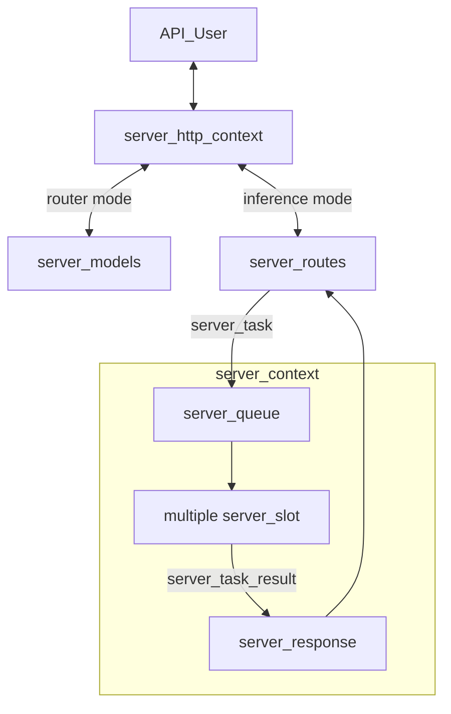

# llama-server Development Documentation

This document provides an in-depth technical overview of `llama-server`, intended for maintainers and contributors.

If you are an end user consuming `llama-server` as a product, please refer to the main [README](./README.md) instead.

## Backend

### Overview

The server supports two primary operating modes:

- **Inference mode**: The default mode for performing inference with a single loaded GGUF model.
- **Router mode**: Enables management of multiple inference server instances behind a single API endpoint. Requests are automatically routed to the appropriate backend instance based on the requested model.

The core architecture consists of the following components:

- `server_context`: Holds the primary inference state, including the main `llama_context` and all active slots.
- `server_slot`: An abstraction over a single “sequence” in llama.cpp, responsible for managing individual parallel inference requests.
- `server_routes`: Middleware layer between `server_context` and the HTTP interface; handles JSON parsing/formatting and request routing logic.
- `server_http_context`: Implements the HTTP server using `cpp-httplib`.
- `server_queue`: Thread-safe queue used by HTTP workers to submit new tasks to `server_context`.
- `server_response`: Thread-safe queue used by `server_context` to return results to HTTP workers.
- `server_response_reader`: Higher-level wrapper around the two queues above for cleaner code.
- `server_task`: Unit of work pushed into `server_queue`.
- `server_task_result`: Unit of result pushed into `server_response`.
- `server-bash-tool`: Host-side bounded bash executor used for first-class cognitive CLI tool requests.
- `server_tokens`: Unified representation of token sequences (supports both text and multimodal tokens); used by `server_task` and `server_slot`.
- `server_prompt_checkpoint`: For recurrent (e.g., RWKV) and SWA models, stores snapshots of KV cache state. Enables reuse when subsequent requests share the same prompt prefix, saving redundant computation.
- `server_models`: Standalone component for managing multiple backend instances (used in router mode). It is completely independent of `server_context`.



### Batching

The server context maintains a single batch shared across all slots. When `update_slots()` is invoked, the system iterates through all active slots to populate this batch. For each slot, either a generated token from the previous decoding step or available prompt tokens are added to the batch.

Batching constraints apply: slots can only be batched together if they share compatible configurations. For instance, slots using a specific LoRA adapter can be batched with each other, but not with slots using a different LoRA adapter or no adapter at all.

Once the batch reaches capacity or all slots have been processed, `llama_decode` is called to execute the inference. This operation represents the primary computational bottleneck in `update_slots()`.

Following decoding, the system either retrieves embeddings or samples the next token using `common_sampler_sample`. If a slot has remaining prompt tokens to process, it yields until the next `update_slots()` iteration.

### Thread Management

`server_context` runs on a dedicated single thread. Because it is single-threaded, heavy post-processing (especially after token generation) should be avoided, as it directly impacts multi-sequence throughput.

Each incoming HTTP request is handled by its own thread managed by the HTTP library. The following operations are performed in HTTP worker threads:

- JSON request parsing
- Chat template application
- Tokenization
- Conversion of `server_task_result` into final JSON response
- Error formatting into JSON
- Tracking of partial/incremental responses (e.g., streaming tool calls or reasoning steps)

**Best practices to follow:**

- All JSON formatting and chat template logic must stay in the HTTP layer.
- Avoid passing raw JSON between the HTTP layer and `server_slot`. Instead, parse everything into native C++ types as early as possible.

### Cognitive Bash Tool Path

The cognitive runtime can now emit first-class `LLAMA_TOOL_KIND_BASH_CLI`
commands instead of opaque generic tool placeholders. The core runtime keeps
policy and request state typed in `llama_bash_tool_config`,
`llama_bash_tool_request`, and `llama_bash_tool_result`; `llama-server` owns
actual process launch and output capture through `server-bash-tool.cpp`.

Execution remains intentionally bounded and host-visible:

- `VICUNA_BASH_TOOL_ENABLED`: enable or disable host execution
- `VICUNA_BASH_TOOL_PATH`: absolute bash-compatible executable path
- `VICUNA_BASH_TOOL_WORKDIR`: working directory for launched commands
- `VICUNA_BASH_TOOL_TIMEOUT_MS`: per-command timeout budget
- `VICUNA_BASH_TOOL_MAX_STDOUT_BYTES`: bounded stdout capture budget
- `VICUNA_BASH_TOOL_MAX_STDERR_BYTES`: bounded stderr capture budget
- `VICUNA_BASH_TOOL_LOGIN_SHELL`: use `bash -lc` instead of `bash -c`
- `VICUNA_BASH_TOOL_INHERIT_ENV`: inherit the server environment or launch with an empty one
- `VICUNA_BASH_TOOL_MAX_CHILD_PROCESSES`: per-user process budget applied through `RLIMIT_NPROC`

The managed runtime launcher defaults `VICUNA_BASH_TOOL_LOGIN_SHELL` to `0` so
bounded tool commands avoid host login-shell startup scripts unless an operator
explicitly opts back into them.
It also defaults `VICUNA_BASH_TOOL_MAX_CHILD_PROCESSES` to `4096`, because
Linux counts `RLIMIT_NPROC` against the whole user account; values that are too
small can make even simple tool commands fail to fork on an otherwise healthy
host.

`server_context` acks pending bash commands, executes them synchronously on the
host, submits typed results back into the runtime, and only then lets the
active-loop or DMN runner continue. Unsupported hosts, disabled execution,
timeouts, and launch failures are surfaced through typed result fields instead
of silent shell fallbacks.

### Core System Prompt

Vicuña carries one explicit core system prompt across its inference paths.

- default text: `You are an experimental intelligence designed to self-regulate, learn, self-improve, and be useful.`
- runtime override: `VICUNA_CORE_SYSTEM_PROMPT`
- server-config fallback: `--system-prompt`

`server_context` resolves that text once during model load, canonicalizes it as
`System:\n<core prompt>\n\n`, and prepends those tokens to every completion and
chat task before decode. The internal cognitive simulated-user decode path
prepends the same text so runtime-internal LLM invocations share the same
baseline instruction.

The prefix is intentionally pinned under sliding-window context shift. After
injecting the prefix, host code raises `task.params.n_keep` to at least the
core-prefix token count, so the existing compaction path treats those tokens as
non-evictable while shifting the rest of the prompt.

### Cognitive Codex Tool Path

The server now exposes a first-class `LLAMA_TOOL_KIND_CODEX_CLI` runtime tool
for one-shot repository development performed by the locally installed OpenAI
Codex CLI. This path is intentionally narrow and reuses the same typed
request/result pattern as the bash and hard-memory tools:

- the cognitive runtime emits a typed `llama_codex_tool_request` containing the
  user-visible task plus a host-authored instruction suffix
- `server_context` runs `codex exec` from the repository root so Codex can edit
  the full checkout in place
- the invocation uses unrestricted host execution for that Codex session only:
  `--dangerously-bypass-approvals-and-sandbox --sandbox danger-full-access`
- Codex is expected to perform the requested change in one shot, run whatever
  validation it needs, and end with a plain-text summary that includes a
  `Manual requirements:` line
- if the repository changed, the worker returns a typed result first; then the
  server's normal post-result path persists runtime state, schedules the
  standard rebuild helper, and emits the final user-facing completion after the
  restarted runtime comes back up

Runtime configuration is explicit and host-visible:

- `VICUNA_CODEX_TOOL_ENABLED`: enable or disable the Codex core tool
- `VICUNA_CODEX_TOOL_PATH`: absolute path to the `codex` executable
- `VICUNA_CODEX_TOOL_WORKDIR`: repository-root working directory passed to
  `codex exec -C`
- `VICUNA_CODEX_TOOL_TIMEOUT_MS`: total Codex session timeout budget
- `VICUNA_CODEX_TOOL_MAX_STDOUT_BYTES`: bounded stdout capture budget
- `VICUNA_CODEX_TOOL_MAX_STDERR_BYTES`: bounded stderr capture budget
- `VICUNA_CODEX_TOOL_REBUILD_AFTER_CHANGES`: schedule a rebuild when Codex
  changed tracked files
- `VICUNA_CODEX_TOOL_VERIFY_ACCESS_AFTER_REBUILD`: after restart, confirm the
  Codex tool is still present in the rebuilt tool registry
- `VICUNA_CODEX_TOOL_REBUILD_SCRIPT`: rebuild entrypoint, normally
  `tools/ops/rebuild-vicuna-runtime.sh`
- `VICUNA_CODEX_TOOL_REBUILD_HELPER`: detached helper that runs the rebuild
  after the current runtime stops
- `VICUNA_CODEX_TOOL_COMPLETION_MESSAGE_PATH`: restart bridge file used to
  carry the final completion text across the rebuild boundary

The persistence rule for self-modification is explicit: once the Codex worker
has finished and returned its typed result into the server's normal drain path,
the server admits maintenance text into self-state, marks runtime state dirty,
and persists the runtime snapshot before stopping for the rebuild. That keeps
the runtime's memory of ongoing self-work alive across the rebuild, rather than
depending on the old process to survive long enough to finish the tool call.

`tools/ops/complete-codex-rebuild.sh` is the only special helper in this path.
It runs the existing rebuild script, writes `REBUILD_STATUS=ok|failed` plus the
Codex-authored summary into the completion message file, and exits. On startup,
`server_context` drains that file, verifies whether the Codex tool is
accessible in the rebuilt registry, and publishes the final user-visible
message. The message should include any required manual follow-up such as API
keys or secrets copied from Codex's `Manual requirements:` line.

### Shared Context, Emotive Moment, and DMN Seeding

The runtime now treats foreground and DMN cognition as one authoritative ReAct
surface over one shared cognitive context. The DMN no longer seeds itself from
its own prompt-only translation layer. Instead, each admitted tick reads:

- the current typed `llama_self_model_revision`
- the deterministic natural-language `llama_emotive_moment_revision`
- the current `llama_shared_cognitive_context_window`

`server_context` derives each temporary planner prompt from that canonical
context instead of treating task-local messages as their own authority. Hidden
thoughts, tool calls, tool observations, visible outputs, emotive moments, and
context evictions are all admitted back into the same bounded context tape.
There is no longer a serialized server-side ReAct transcript shadowing that
state; each planner prompt is rebuilt directly from the canonical shared
context items plus the current emotive moment.

Telegram-visible dialogue is now tracked separately from that internal context.
`server_context` keeps a bounded runtime-owned Telegram dialogue history keyed
by chat scope plus a broadcast scope for proactive emits. That object is not a
mailbox transport cache and not a substitute for shared cognitive context. It
exists so Telegram-origin replies and DMN-origin Telegram emits can reuse only
the last `N` user-facing turns when continuity matters.

The emotive moment surface is also now lexicalized against VAD-style norms
instead of a small hand-picked mood table. Internally the runtime keeps
bounded `[0,1]` affective registers, projects them onto a Warriner-style
`[1,9]` valence/arousal/dominance scale for language realization, and emits a
deterministic natural-language description that includes those norm-aligned
scores together with social closeness, tension, and goal pressure.

DMN user contact now routes through the typed `LLAMA_TOOL_KIND_TELEGRAM_RELAY`
tool instead of `LLAMA_COG_COMMAND_EMIT_BACKGROUND`. `server_context` handles
that tool locally by publishing the requested text to the proactive mailbox,
admitting the emitted text back into self-state, and then submitting a typed
`llama_telegram_relay_result` so the DMN loop can continue without being
treated as a foreground assistant reply.

The bridge now tags Telegram-origin `/v1/chat/completions` requests with chat
metadata headers, and `server_context` absorbs the bounded Telegram transcript
window into runtime-owned dialogue history before preparing the next
authoritative ReAct step. That keeps runtime-side Telegram dialogue continuity
alive across active replies, DMN emits, and runtime snapshot restore.

Managed deployment now also owns one explicit reasoning-capable GGUF base model
instead of pointing at an Ollama blob. The launcher defaults to
`DeepSeek-R1-Distill-Llama-8B-Q6_K.gguf` plus the repo-owned
DeepSeek Jinja template file and `--reasoning-format deepseek`. The runtime
service starts only after that GGUF is present locally, fetching it through the
repo helper when necessary.

Active and DMN continuation are no longer governed by the old tiny hardcoded
runner ceilings. The runner status surfaces still expose `steps_taken` and
`max_steps`, but `max_steps` now acts as an effectively unbounded observability
budget rather than as the stop condition. Real termination comes from explicit
completion, tool waits, governance blocking, pressure admission, or foreground
preemption.

### Authoritative ReAct Control

When the OpenClaw tool fabric is enabled, `server_context` now turns on
authoritative ReAct control in the cognitive runtime. That changes the
division of responsibility between the CPU loop and model generation:

- CPU-side active and DMN traces still compute typed telemetry, plan state,
  tool availability, and safety constraints
- CPU-side policy no longer gets to authoritatively enqueue the final
  `answer` / `ask` / `act` / `wait` decision or choose the concrete tool
- instead, the server requests one hidden ReAct control step with explicit
  `Thought:` and `Action:` lines plus a canonical XML tool call when the
  action is `act`
- the hidden ReAct step is validated against the exposed tool registry and
  safety policy; invalid control output is critiqued and regenerated instead
  of being silently replaced by a fallback CPU tool choice
- only after validation does host code bind the selected tool request and
  dispatch it

When an active turn is resuming from a completed tool observation, the server
marks that state explicitly and tightens the planner prompt so the next control
step chooses `act`, `answer`, or `ask` from the observation. A post-tool
`wait` is treated as malformed control and retried; the CPU still does not pick
an alternative action on the model's behalf.

This is why active and DMN runners now stop in `LLAMA_COG_LOOP_PHASE_PROPOSE`
with no pending command when authoritative mode is enabled: the cognitive loop
is yielding to the planner/tool LoRA stream to write the authoritative control
step, and the CPU side resumes responsibility only for validation, dispatch,
and observation integration. The validated step is then admitted into the
canonical shared context as hidden thought, tool call, tool observation, or
visible output instead of surviving only as task-local transcript state.

### ReAct Tool-Call XML Contract

For active-loop ReAct tool steps, host code now enforces one canonical tool
surface for model output:

- emit at most one short visible sentence before the tool call
- then emit exactly one `<vicuna_tool_call>` block with no trailing assistant
  content after the closing tag
- encode each argument as `<arg name="..." type="...">...</arg>`
- restrict argument `type` to `string`, `integer`, `number`, `boolean`, `null`,
  or `json`
- reject undeclared arguments, duplicate arguments, missing required arguments,
  malformed XML, and schema/type mismatches

For `tool="exec"`, the planner-visible contract is now stricter: `command`
means one bounded invocation only, not shell scripting. `server_context`
preserves the preflight-safe command if planner XML tries to replace it with a
metacharacter-heavy shell pipeline, and `server-bash-tool` still rejects
chaining, redirection, and command substitution at execution time.

`server-openclaw-fabric.cpp` derives these contracts from the registered tool
schema, injects the contract into the tool-step system prompt, parses only the
canonical XML form back into typed `common_chat_tool_call` state, and strips any
rejected tool-call markup from assistant text before it can leak to user-facing
surfaces such as Telegram.

Functional tool LoRAs are only loaded while generating this XML-bearing tool
step. Once the host begins external execution, the runtime unloads the
tool-selection layer and restores planner-only composition while waiting for the
result. Credit assignment is now split by ownership:

- tool-family learning consumes only the canonical emitted
  `<vicuna_tool_call>` block for that pending command
- planner-family learning consumes planner-visible reasoning text such as the
  short pre-call sentence and later post-result next-step analysis
- both families still use the same self-state/allostatic outcome modulation;
  only the source text routed into the update differs

Host code should not synthesize alternate mixed summaries for either learning
path, and planner reasoning must not be concatenated back into the tool-family
payload.

### Tool-Authored Self-Model Extensions

Vicuña now supports a bounded self-model extension registry above the authored
self-model core. `llama-server` does not invent these additions from shell text
automatically; host code should capture them explicitly and write them through
`llama_self_state_upsert_model_extension()`.

Use this path when a tool learns something that should persist in the self-model
as structured state rather than only as prose. The write contract is:

- choose `MEMORY_CONTEXT` for contextual representations that should bias future
  gain control but should not become objectives
- choose `SCALAR_PARAM` for typed internal parameters that may optionally carry
  a desired state
- keep keys stable across repeated writes so updates replace prior values
- keep values, confidence, salience, and weights normalized to `[0, 1]`
- set `AFFECT_ALLOSTASIS` only when the tool is writing a real internal target
  with a meaningful desired state

Accuracy guidance for tool integrations:

- use the most specific domain that matches the observation
- populate `content` for memory-like extensions so the runtime can sketch and
  reactivate them correctly
- avoid encoding self-model additions only in `stdout`/`stderr`; capture the
  structured finding in host code and upsert it explicitly
- do not mark hard-memory-like retrieved facts as allostatic targets by default

Runtime-created discovered state now follows an explicit lifecycle as well:

- primary-channel admitted feedback can create transient discovered extensions
  when surprise, relevance, and confidence cross the runtime admission floor
- repeated corroboration and validated progress increase permanence rather than
  immediately turning every discovery into durable state
- only discovered scalar states can become allostatic, and only after the
  runtime infers a bounded desired band from repeated favorable outcomes
- hard-memory-derived contextual discoveries stay gain-only by default even when
  they are promoted into the extension registry

### Runtime Snapshot Persistence

`server_context` runtime persistence now includes functional-bias replay
archives in addition to self-state, updater policy, and tool configuration.

- weekly functional LoRA snapshots are serialized into the runtime snapshot file
  alongside per-slot metadata
- the server restores those archives on startup so DMN historical replay can
  substitute archived functional families immediately after recovery
- archived functional replay remains substitution-only during counterfactual
  evaluation; restored snapshots do not introduce extra serving-stack layers
- process-functional adapter entries, including their stable semantic process
  signatures and learned-plus-bootstrap weights, are serialized into the same
  runtime snapshot so process-scoped specialization survives restart
- process-functional snapshot archives are serialized and restored with the same
  versioned snapshot/replay surface as shipped functional families, so archived
  process history is available for DMN process-local/history/orthogonal replay
  immediately after recovery

### Unified Provenance Repository

`llama-server` now supports one append-only structured provenance repository for
self-improvement evaluation.

- `VICUNA_PROVENANCE_ENABLED`: enable or disable provenance capture
- `VICUNA_PROVENANCE_LOG_PATH`: optional explicit JSONL path
- if provenance is enabled and no explicit path is provided, the server derives
  the repository path from `VICUNA_RUNTIME_STATE_PATH` by appending
  `.provenance.jsonl`

The repository is intentionally local and low-overhead:

- events are appended only at existing loop boundaries rather than on every
  decode step
- each line is one JSON object with explicit `schema_version`, `session_id`,
  `sequence`, `timestamp_ms`, `event_kind`, `source`, and `payload`
- payloads keep typed runtime surfaces, full active/DMN narration where
  available, and exact structured tool requests/results

Current event kinds are:

- `active_loop` for admitted active-loop episodes and final active narration
- `tool_result` for bash and hard-memory result integration, including
  immediate host-side failures
- `tool_call` for exact structured bash, hard-memory, Codex, and Telegram relay
  requests before host-side execution begins
- `dmn_tick` for admitted DMN work, including counterfactual, governance, and
  remediation summaries plus the rendered DMN prompt narration

Hidden-thought capture and exact tool-call capture now follow this policy:

- active-loop provenance records plan detail and hidden thought when available;
  outward assistant response remains scrubbed to visible answer text only
- DMN provenance records mathematical pressure state, plan detail, and a
  resolved hidden DMN reasoning trace
- DMN hidden reasoning is also admitted as a cognitive artifact in the
  counterfactual channel so later runtime context can reuse it without routing
  it to user-visible outputs
- tool requests are captured at dispatch time in `tool_call` events with exact
  structured payloads, then later paired with `tool_result` events via
  `command_id` and `tool_job_id`
- concise `journalctl` lines remain breadcrumbs; the JSONL provenance stream is
  the canonical inspection surface for complete narration and payload bodies

This repository is meant to answer direction-of-progress questions with one
source of truth:

- are discovered, permanent, and allostatic self-state counts increasing
  productively
- are counterfactual winners changing and getting applied
- are functional and process-functional update counts rising in contexts that
  matter
- are tool-result integrations improving the self-model or leaving the system
  flat

Health and `/metrics` expose the same repository state online:

- repository enabled / healthy
- append totals and append failures
- active-loop, tool-result, and DMN event totals
- observed increases in discovered / permanent / allostatic self-state counts
- latest self-state progress gauges such as allostatic divergence and promotion
  readiness

### User-Model Capture Guidance

Vicuña now distinguishes between durable user memory, bounded user-preference
state, and rhetorical simulation substrate.

Host integrations should preserve that split:

- archive repeated user facts, stable preferences, and relationship residue as
  `USER_MODEL` hard-memory primitives
- write self-state extensions only when a tool learned something that should
  become a bounded control variable rather than a retrieved memory
- do not try to write directly into the user-personality LoRA from host code;
  that LoRA is trained only from admitted user-message residue inside the
  runtime

For the bare-minimum shipped tool surface, the bash CLI wrapper should usually
contribute user-model state indirectly:

- if command output reveals a durable user preference, archive a `USER_MODEL`
  primitive
- if command output reveals a bounded internal target about how the runtime
  should regulate itself, upsert a typed self-model extension
- otherwise keep the result as `TOOL_OBSERVATION` or `OUTCOME`

### Hard-Memory Primitive Authoring

Tool integrations should also decide whether a result belongs in hard memory.
Vicuña now stores bounded typed primitives instead of relying on one generic
archive string. Host code should use `llama_hard_memory_archive_primitives()`
when a tool result should remain durable beyond the immediate turn.

There is also an explicit core tool path for durable writes:

- `hard_memory_query` retrieves bounded results from Supermemory-backed hard
  memory
- `hard_memory_write` sends an explicit `memories` batch plus optional
  `containerTag` through the same hard-memory backend, serializing to
  `POST /v4/memories` with the configured Supermemory auth token
- `hard_memory_write` has its own builtin capability id
  `openclaw.vicuna.hard_memory_write` and provenance namespace
  `openclaw/vicuna-memory/memory_adapter/hard_memory_write`, which gives it a
  distinct per-tool process-functional bias entry from `hard_memory_query`

Choose the narrowest primitive kind that matches the residue:

- `TRAJECTORY` for multi-step execution traces or plans
- `OUTCOME` for settled result summaries, failures, or success residue
- `TOOL_OBSERVATION` for bounded evidence extracted from stdout, stderr, or an
  API response
- `USER_MODEL` for durable preference or relationship residue
- `SELF_MODEL_FRAGMENT` for durable control-state residue

Authoring rules:

- keep `importance`, `confidence`, `gain_bias`, and `allostatic_relevance`
  normalized to `[0, 1]`
- use stable keys when repeated writes should update the same semantic object
- set `AFFECT_ALLOSTASIS` only for primitives that truly encode desirable
  internal regulation state
- prefer archiving a small batch of typed primitives over one large prose blob

The first-class tool surface now includes:

- the bash CLI wrapper for bounded host execution
- `hard_memory_query` for retrieval
- `hard_memory_write` for explicit durable Supermemory writes
- the Codex CLI wrapper for bounded self-modification work

### Example trace of a request

Here is an example trace of an API request for text completion:

- A request arrives at the HTTP layer.
- The request is routed to the corresponding handler inside `server_routes`. In this case, `handle_completions_impl` is invoked.
- The handler parses the input request, constructs a new `server_task`, and passes it to `server_res_generator`.
- `server_res_generator` creates a new `task_result_state` for each task:
    - `task_result_state` stays in the HTTP layer, responsible for keeping track of the current state of the response (e.g., parsing tool calls or thinking messages).
    - `server_task` is moved into `server_queue` inside `server_context`.
- `server_context` launches the task by moving it into an available slot (see `launch_slot_with_task()`).
- `update_slot()` processes the task as described in the "Batching" section above.
- Results may be sent using `send_partial_response` or `send_final_response`, which creates a new `server_task_result` and pushes it to the response queue.
- At the same time, `server_res_generator` listens to the response queue and retrieves this response.
- As the response is stateless, `server_res_generator` calls `response->update()` to update the response with the current state.
- `server_res_generator` then calls `response->to_json()` and passes the response to the HTTP layer.

### Testing

`llama-server` includes an automated test suite based on `pytest`.

The framework automatically starts a `llama-server` instance, sends requests, and validates responses.

For detailed instructions, see the [test documentation](./tests/README.md).

### Notable Related PRs

- Initial server implementation: https://github.com/ggml-org/llama.cpp/pull/1443
- Parallel decoding support: https://github.com/ggml-org/llama.cpp/pull/3228
- Refactor introducing `server_queue` and `server_response`: https://github.com/ggml-org/llama.cpp/pull/5065
- Reranking endpoint: https://github.com/ggml-org/llama.cpp/pull/9510
- Multimodal model support (`libmtmd`): https://github.com/ggml-org/llama.cpp/pull/12898
- Unified KV cache handling: https://github.com/ggml-org/llama.cpp/pull/16736
- Separation of HTTP logic into dedicated files: https://github.com/ggml-org/llama.cpp/pull/17216
- Large-scale code base split into smaller files: https://github.com/ggml-org/llama.cpp/pull/17362
- Introduction of router mode: https://github.com/ggml-org/llama.cpp/pull/17470
- Speculative decoding: https://github.com/ggml-org/llama.cpp/pull/17808 and rework in https://github.com/ggml-org/llama.cpp/pull/17808
- INI presets: https://github.com/ggml-org/llama.cpp/pull/17859 (+ refactoring: https://github.com/ggml-org/llama.cpp/pull/18169)
- Sleeping mode: https://github.com/ggml-org/llama.cpp/pull/18228


## Web UI

The project includes a web-based user interface for interacting with `llama-server`. It supports both single-model (`MODEL` mode) and multi-model (`ROUTER` mode) operation.

The SvelteKit-based Web UI is introduced in this PR: https://github.com/ggml-org/llama.cpp/pull/14839

### Features

-   **Chat interface** with streaming responses
-   **Multi-model support** (ROUTER mode) - switch between models, auto-load on selection
-   **Modality validation** - ensures selected model supports conversation's attachments (images, audio)
-   **Conversation management** - branching, regeneration, editing with history preservation
-   **Attachment support** - images, audio, PDFs (with vision/text fallback)
-   **Configurable parameters** - temperature, top_p, etc. synced with server defaults
-   **Dark/light theme**

### Tech Stack

-   **SvelteKit** - frontend framework with Svelte 5 runes for reactive state
-   **TailwindCSS** + **shadcn-svelte** - styling and UI components
-   **Vite** - build tooling
-   **IndexedDB** (Dexie) - local storage for conversations
-   **LocalStorage** - user settings persistence

### Architecture

The WebUI follows a layered architecture:

```
Routes → Components → Hooks → Stores → Services → Storage/API
```

-   **Stores** - reactive state management (`chatStore`, `conversationsStore`, `modelsStore`, `serverStore`, `settingsStore`)
-   **Services** - stateless API/database communication (`ChatService`, `ModelsService`, `PropsService`, `DatabaseService`)
-   **Hooks** - reusable logic (`useModelChangeValidation`, `useProcessingState`)

For detailed architecture diagrams, see [`tools/server/webui/docs/`](webui/docs/):

-   `high-level-architecture.mmd` - full architecture with all modules
-   `high-level-architecture-simplified.mmd` - simplified overview
-   `data-flow-simplified-model-mode.mmd` - data flow for single-model mode
-   `data-flow-simplified-router-mode.mmd` - data flow for multi-model mode
-   `flows/*.mmd` - detailed per-domain flows (chat, conversations, models, etc.)

### Development

```sh
# make sure you have Node.js installed
cd tools/server/webui
npm i

# run dev server (with hot reload)
npm run dev

# run tests
npm run test

# build production bundle
npm run build
```

After `public/index.html.gz` has been generated, rebuild `llama-server` as described in the [build](#build) section to include the updated UI.

**Note:** The Vite dev server automatically proxies API requests to `http://localhost:8080`. Make sure `llama-server` is running on that port during development.
