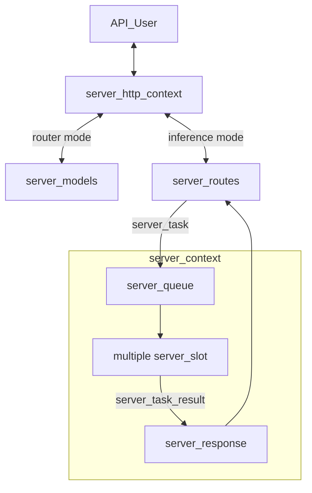

# llama-server Development Documentation

This document provides an in-depth technical overview of `llama-server`, intended for maintainers and contributors.

If you are an end user consuming `llama-server` as a product, please refer to the main [README](./README.md) instead.

## Backend

### Overview

The server supports two primary operating modes:

- **Inference mode**: The default mode for performing inference with a single loaded GGUF model.
- **Router mode**: Enables management of multiple inference server instances behind a single API endpoint. Requests are automatically routed to the appropriate backend instance based on the requested model.

The core architecture consists of the following components:

- `server_context`: Holds the primary inference state, including the main `llama_context` and all active slots.
- `server_slot`: An abstraction over a single “sequence” in llama.cpp, responsible for managing individual parallel inference requests.
- `server_routes`: Middleware layer between `server_context` and the HTTP interface; handles JSON parsing/formatting and request routing logic.
- `server_http_context`: Implements the HTTP server using `cpp-httplib`.
- `server_queue`: Thread-safe queue used by HTTP workers to submit new tasks to `server_context`.
- `server_response`: Thread-safe queue used by `server_context` to return results to HTTP workers.
- `server_response_reader`: Higher-level wrapper around the two queues above for cleaner code.
- `server_task`: Unit of work pushed into `server_queue`.
- `server_task_result`: Unit of result pushed into `server_response`.
- `server-bash-tool`: Host-side bounded bash executor used for first-class cognitive CLI tool requests.
- `server_tokens`: Unified representation of token sequences (supports both text and multimodal tokens); used by `server_task` and `server_slot`.
- `server_prompt_checkpoint`: For recurrent (e.g., RWKV) and SWA models, stores snapshots of KV cache state. Enables reuse when subsequent requests share the same prompt prefix, saving redundant computation.
- `server_models`: Standalone component for managing multiple backend instances (used in router mode). It is completely independent of `server_context`.



### Batching

The server context maintains a single batch shared across all slots. When `update_slots()` is invoked, the system iterates through all active slots to populate this batch. For each slot, either a generated token from the previous decoding step or available prompt tokens are added to the batch.

Batching constraints apply: slots can only be batched together if they share compatible configurations. For instance, slots using a specific LoRA adapter can be batched with each other, but not with slots using a different LoRA adapter or no adapter at all.

Once the batch reaches capacity or all slots have been processed, `llama_decode` is called to execute the inference. This operation represents the primary computational bottleneck in `update_slots()`.

Following decoding, the system either retrieves embeddings or samples the next token using `common_sampler_sample`. If a slot has remaining prompt tokens to process, it yields until the next `update_slots()` iteration.

### Thread Management

`server_context` runs on a dedicated single thread. Because it is single-threaded, heavy post-processing (especially after token generation) should be avoided, as it directly impacts multi-sequence throughput.

Each incoming HTTP request is handled by its own thread managed by the HTTP library. The following operations are performed in HTTP worker threads:

- JSON request parsing
- Chat template application
- Tokenization
- Conversion of `server_task_result` into final JSON response
- Error formatting into JSON
- Tracking of partial/incremental responses (e.g., streaming tool calls or reasoning steps)

**Best practices to follow:**

- All JSON formatting and chat template logic must stay in the HTTP layer.
- Avoid passing raw JSON between the HTTP layer and `server_slot`. Instead, parse everything into native C++ types as early as possible.

### Cognitive Bash Tool Path

The cognitive runtime can now emit first-class `LLAMA_TOOL_KIND_BASH_CLI`
commands instead of opaque generic tool placeholders. The core runtime keeps
policy and request state typed in `llama_bash_tool_config`,
`llama_bash_tool_request`, and `llama_bash_tool_result`; `llama-server` owns
actual process launch and output capture through `server-bash-tool.cpp`.

Execution remains intentionally bounded and host-visible:

- `VICUNA_BASH_TOOL_ENABLED`: enable or disable host execution
- `VICUNA_BASH_TOOL_PATH`: absolute bash-compatible executable path
- `VICUNA_BASH_TOOL_WORKDIR`: working directory for launched commands
- `VICUNA_BASH_TOOL_TIMEOUT_MS`: per-command timeout budget
- `VICUNA_BASH_TOOL_MAX_STDOUT_BYTES`: bounded stdout capture budget
- `VICUNA_BASH_TOOL_MAX_STDERR_BYTES`: bounded stderr capture budget
- `VICUNA_BASH_TOOL_LOGIN_SHELL`: use `bash -lc` instead of `bash -c`
- `VICUNA_BASH_TOOL_INHERIT_ENV`: inherit the server environment or launch with an empty one

`server_context` acks pending bash commands, executes them synchronously on the
host, submits typed results back into the runtime, and only then lets the
active-loop or DMN runner continue. Unsupported hosts, disabled execution,
timeouts, and launch failures are surfaced through typed result fields instead
of silent shell fallbacks.

### Tool-Authored Self-Model Extensions

Vicuña now supports a bounded self-model extension registry above the authored
self-model core. `llama-server` does not invent these additions from shell text
automatically; host code should capture them explicitly and write them through
`llama_self_state_upsert_model_extension()`.

Use this path when a tool learns something that should persist in the self-model
as structured state rather than only as prose. The write contract is:

- choose `MEMORY_CONTEXT` for contextual representations that should bias future
  gain control but should not become objectives
- choose `SCALAR_PARAM` for typed internal parameters that may optionally carry
  a desired state
- keep keys stable across repeated writes so updates replace prior values
- keep values, confidence, salience, and weights normalized to `[0, 1]`
- set `AFFECT_ALLOSTASIS` only when the tool is writing a real internal target
  with a meaningful desired state

Accuracy guidance for tool integrations:

- use the most specific domain that matches the observation
- populate `content` for memory-like extensions so the runtime can sketch and
  reactivate them correctly
- avoid encoding self-model additions only in `stdout`/`stderr`; capture the
  structured finding in host code and upsert it explicitly
- do not mark hard-memory-like retrieved facts as allostatic targets by default

### Runtime Snapshot Persistence

`server_context` runtime persistence now includes functional-bias replay
archives in addition to self-state, updater policy, and tool configuration.

- weekly functional LoRA snapshots are serialized into the runtime snapshot file
  alongside per-slot metadata
- the server restores those archives on startup so DMN historical replay can
  substitute archived functional families immediately after recovery
- archived functional replay remains substitution-only during counterfactual
  evaluation; restored snapshots do not introduce extra serving-stack layers

### User-Model Capture Guidance

Vicuña now distinguishes between durable user memory, bounded user-preference
state, and rhetorical simulation substrate.

Host integrations should preserve that split:

- archive repeated user facts, stable preferences, and relationship residue as
  `USER_MODEL` hard-memory primitives
- write self-state extensions only when a tool learned something that should
  become a bounded control variable rather than a retrieved memory
- do not try to write directly into the user-personality LoRA from host code;
  that LoRA is trained only from admitted user-message residue inside the
  runtime

For the bare-minimum shipped tool surface, the bash CLI wrapper should usually
contribute user-model state indirectly:

- if command output reveals a durable user preference, archive a `USER_MODEL`
  primitive
- if command output reveals a bounded internal target about how the runtime
  should regulate itself, upsert a typed self-model extension
- otherwise keep the result as `TOOL_OBSERVATION` or `OUTCOME`

### Hard-Memory Primitive Authoring

Tool integrations should also decide whether a result belongs in hard memory.
Vicuña now stores bounded typed primitives instead of relying on one generic
archive string. Host code should use `llama_hard_memory_archive_primitives()`
when a tool result should remain durable beyond the immediate turn.

Choose the narrowest primitive kind that matches the residue:

- `TRAJECTORY` for multi-step execution traces or plans
- `OUTCOME` for settled result summaries, failures, or success residue
- `TOOL_OBSERVATION` for bounded evidence extracted from stdout, stderr, or an
  API response
- `USER_MODEL` for durable preference or relationship residue
- `SELF_MODEL_FRAGMENT` for durable control-state residue

Authoring rules:

- keep `importance`, `confidence`, `gain_bias`, and `allostatic_relevance`
  normalized to `[0, 1]`
- use stable keys when repeated writes should update the same semantic object
- set `AFFECT_ALLOSTASIS` only for primitives that truly encode desirable
  internal regulation state
- prefer archiving a small batch of typed primitives over one large prose blob

For the bare-minimum shipped system, the only first-class tool path is the bash
CLI wrapper. That path should remain conservative: write `TOOL_OBSERVATION` or
`OUTCOME` when command results are durable, and use self-model extension writes
only when the command changed the system's internal model rather than merely
producing evidence.

### Example trace of a request

Here is an example trace of an API request for text completion:

- A request arrives at the HTTP layer.
- The request is routed to the corresponding handler inside `server_routes`. In this case, `handle_completions_impl` is invoked.
- The handler parses the input request, constructs a new `server_task`, and passes it to `server_res_generator`.
- `server_res_generator` creates a new `task_result_state` for each task:
    - `task_result_state` stays in the HTTP layer, responsible for keeping track of the current state of the response (e.g., parsing tool calls or thinking messages).
    - `server_task` is moved into `server_queue` inside `server_context`.
- `server_context` launches the task by moving it into an available slot (see `launch_slot_with_task()`).
- `update_slot()` processes the task as described in the "Batching" section above.
- Results may be sent using `send_partial_response` or `send_final_response`, which creates a new `server_task_result` and pushes it to the response queue.
- At the same time, `server_res_generator` listens to the response queue and retrieves this response.
- As the response is stateless, `server_res_generator` calls `response->update()` to update the response with the current state.
- `server_res_generator` then calls `response->to_json()` and passes the response to the HTTP layer.

### Testing

`llama-server` includes an automated test suite based on `pytest`.

The framework automatically starts a `llama-server` instance, sends requests, and validates responses.

For detailed instructions, see the [test documentation](./tests/README.md).

### Notable Related PRs

- Initial server implementation: https://github.com/ggml-org/llama.cpp/pull/1443
- Parallel decoding support: https://github.com/ggml-org/llama.cpp/pull/3228
- Refactor introducing `server_queue` and `server_response`: https://github.com/ggml-org/llama.cpp/pull/5065
- Reranking endpoint: https://github.com/ggml-org/llama.cpp/pull/9510
- Multimodal model support (`libmtmd`): https://github.com/ggml-org/llama.cpp/pull/12898
- Unified KV cache handling: https://github.com/ggml-org/llama.cpp/pull/16736
- Separation of HTTP logic into dedicated files: https://github.com/ggml-org/llama.cpp/pull/17216
- Large-scale code base split into smaller files: https://github.com/ggml-org/llama.cpp/pull/17362
- Introduction of router mode: https://github.com/ggml-org/llama.cpp/pull/17470
- Speculative decoding: https://github.com/ggml-org/llama.cpp/pull/17808 and rework in https://github.com/ggml-org/llama.cpp/pull/17808
- INI presets: https://github.com/ggml-org/llama.cpp/pull/17859 (+ refactoring: https://github.com/ggml-org/llama.cpp/pull/18169)
- Sleeping mode: https://github.com/ggml-org/llama.cpp/pull/18228


## Web UI

The project includes a web-based user interface for interacting with `llama-server`. It supports both single-model (`MODEL` mode) and multi-model (`ROUTER` mode) operation.

The SvelteKit-based Web UI is introduced in this PR: https://github.com/ggml-org/llama.cpp/pull/14839

### Features

-   **Chat interface** with streaming responses
-   **Multi-model support** (ROUTER mode) - switch between models, auto-load on selection
-   **Modality validation** - ensures selected model supports conversation's attachments (images, audio)
-   **Conversation management** - branching, regeneration, editing with history preservation
-   **Attachment support** - images, audio, PDFs (with vision/text fallback)
-   **Configurable parameters** - temperature, top_p, etc. synced with server defaults
-   **Dark/light theme**

### Tech Stack

-   **SvelteKit** - frontend framework with Svelte 5 runes for reactive state
-   **TailwindCSS** + **shadcn-svelte** - styling and UI components
-   **Vite** - build tooling
-   **IndexedDB** (Dexie) - local storage for conversations
-   **LocalStorage** - user settings persistence

### Architecture

The WebUI follows a layered architecture:

```
Routes → Components → Hooks → Stores → Services → Storage/API
```

-   **Stores** - reactive state management (`chatStore`, `conversationsStore`, `modelsStore`, `serverStore`, `settingsStore`)
-   **Services** - stateless API/database communication (`ChatService`, `ModelsService`, `PropsService`, `DatabaseService`)
-   **Hooks** - reusable logic (`useModelChangeValidation`, `useProcessingState`)

For detailed architecture diagrams, see [`tools/server/webui/docs/`](webui/docs/):

-   `high-level-architecture.mmd` - full architecture with all modules
-   `high-level-architecture-simplified.mmd` - simplified overview
-   `data-flow-simplified-model-mode.mmd` - data flow for single-model mode
-   `data-flow-simplified-router-mode.mmd` - data flow for multi-model mode
-   `flows/*.mmd` - detailed per-domain flows (chat, conversations, models, etc.)

### Development

```sh
# make sure you have Node.js installed
cd tools/server/webui
npm i

# run dev server (with hot reload)
npm run dev

# run tests
npm run test

# build production bundle
npm run build
```

After `public/index.html.gz` has been generated, rebuild `llama-server` as described in the [build](#build) section to include the updated UI.

**Note:** The Vite dev server automatically proxies API requests to `http://localhost:8080`. Make sure `llama-server` is running on that port during development.
